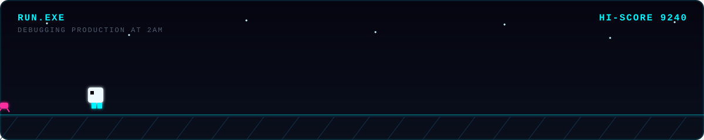

  

<table align="center" width="100%">
  <tr>
    <td align="center">
      WANT THE FULL PICTURE? OPEN A TERMINAL 
      <code>npx adarsh-singh</code>
    </td>
  </tr>
</table>

 

  

## 🐍 Contribution Grid

  <picture>
    <source media="(prefers-color-scheme: dark)" srcset="https://raw.githubusercontent.com/adarshthakur9240/adarshthakur9240/output/github-contribution-grid-snake-dark.svg">
    <source media="(prefers-color-scheme: light)" srcset="https://raw.githubusercontent.com/adarshthakur9240/adarshthakur9240/output/github-contribution-grid-snake.svg">
    
  </picture>

## 🎮 Side Quest

  

## 🚀 The Architect's Blueprint

  

 

*  **High-Throughput Backends:** Scaled **PawAlert** (Node.js/Redis/PostgreSQL) to **5,000+** concurrent connections, resolving spatial queries in sub-**50ms**.
*  **SaaS Monorepos:** Architected the **Q-Ecosystem** (Next.js 14, Turborepo) — a 4-app network enforcing strict Row-Level Security with sub-**80ms** p99 latency.
*  **Algorithmic Obsession:** **Knight**, rated **1868**, **600+** problems solved on LeetCode.

## 🌌 The Technology Ecosystem

  
  

 

| Layer | Stack |
| :--- | :--- |
| **Core Languages** |      |
| **Frontend & UI** |      |
| **Backend & AI Infra** |     |
| **Data & Messaging** |     |
| **Cloud & DevOps** |     |

## 📊 Telemetry & Global Impact

  
  

 

  

## ⚔️ LeetCode Heatmap

  

  <h3>🌟 Featured Build</h3>
  

 

  

 

  

### Let's Connect

 

